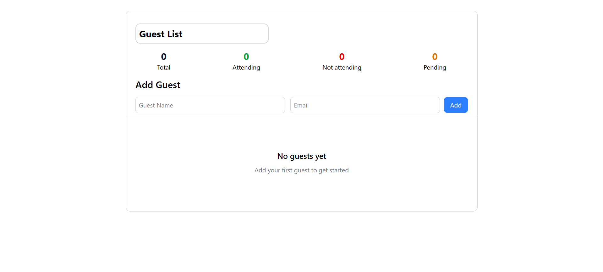

# Event Guest List Manager

A Single Page application for managing a guest list.

## Features

- Adding guests
- Removing guests
- Deleting Guests
- Color-coded status chips
- Quick statistics
- Custom event name

## Preview



## Running the app

1. Clone the repository
   ```bash
   git clone <repository-url>
   ```

2. Navigate to the directory in your file manager and open `index.html` in your browser by double-clicking it.

## Usage

- **Add Guest**: Enter guest name and select status
- **Update Status**: Click on status chips to cycle through options
- **Remove Guest**: Use the delete button next to each guest
- **Event Name**: Click on the event title to customize
- **Statistics**: View real-time counts by status

## Technologies Used

- HTML
- TailwindCSS
- JavaScript

## License

See LICENSE file for details.